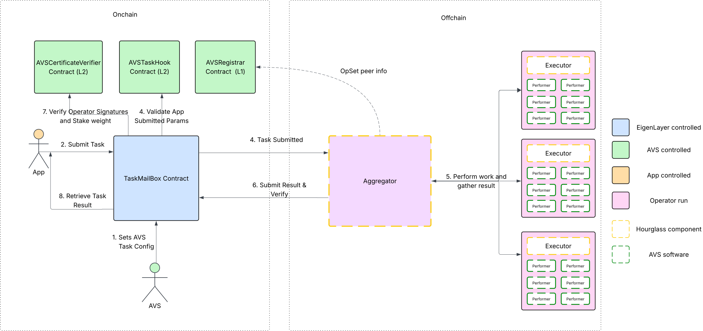

## ⚠️ Warning: This is Alpha, non audited code ⚠️
Hourglass is in active development and is not yet audited. Use at your own risk.

# hourglass-avs-template

## What is Hourglass?

Hourglass is a framework for building a task-based EigenLayer AVS, providing AVS developers a batteries-included experience to get started quickly. It includes a set of tools and libraries that simplify the process of building, deploying, and managing AVS projects.



Hourglass as a framework has onchain and offchain components that work together to enable a task-based AVS.

### Onchain Components

#### TaskMailbox

The TaskMailbox is a singleton eigenlayer hourglass contract on L1 or L2 that is responsible for:

* Allowing users/apps to create tasks.
* Managing the lifecycle of tasks.
* Verifying the results of tasks and making it available for users/apps to query.
* Allowing AVSs to manage their TaskMailbox configurations.

#### TaskAVSRegistrar

The TaskAVSRegistrar is an instanced (per-AVS) eigenlayer middleware contract on L1 that is responsible for:

* Handling operator registration for specific operator sets of your AVS.
* Providing the offchain components with BLS public keys and socket endpoints for the Aggregator and Executor operators.

It works by default, but can be extended to include additional onchain logic for your AVS.

#### AVSTaskHook

The AVSTaskHook is an instanced (per-AVS) eigenlayer hourglass contract on L1 or L2 that is responsible for:

* Validating the task lifecycle.
* Creating fee markets for your AVS.

It's empty by default and works out of the box, but can be extended to include additional onchain validation logic for your AVS.

#### CertificateVerifier

The CertificateVerifier is an instanced (per-AVS) eigenlayer middleware contract on L1 or L2 that is responsible for:

* Verifying the validity of operator certificates.
* Verifying stake threshold requirements for operator sets.

#### Custom Contracts

If your AVS has custom contracts that need to be built and compiled, place them in the `./contracts/src` directory.

```bash
contracts
|-- README.md
|-- script
|   `-- DeployMyContracts.s.sol
|-- src
|   |-- HelloWorld.sol
|   |-- l1-contracts
|   |   `-- TaskAVSRegistrar.sol
|   `-- l2-contracts
|       |-- AVSTaskHook.sol
|       `-- BN254CertificateVerifier.sol
`-- test
    `-- TaskAVSRegistrar.t.sol
```

After adding your contracts, you'll need up update the `script/DeployMyContracts.s.sol` script to correctly instantiate and deploy your contracts. `DeployMyContracts.s.sol` is specifically called during the `devkit avs devnet start` command and will receive the context of the other contracts that have been deployed.

As you can see in this HelloWorld example, we create new `HelloWorld` contract and then return some JSON output about it that is sent back to the Devkit CLI.

```solidity
function run(string memory environment, string memory _context, address /* allocationManager */) public {
        // Read the context
        Context memory context = _readContext(environment, _context);

        vm.startBroadcast(context.deployerPrivateKey);
        console.log("Deployer address:", vm.addr(context.deployerPrivateKey));

        //TODO: Implement custom contracts deployment
        // CustomContract customContract = new CustomContract();
        // console.log("CustomContract deployed to:", address(customContract));
        HelloWorld helloWorld = new HelloWorld();

        vm.stopBroadcast();

        vm.startBroadcast(context.avsPrivateKey);
        console.log("AVS address:", context.avs);

        //TODO: Implement any additional AVS setup

        vm.stopBroadcast();

        //TODO: Write to output file
        Output[] memory outputs = new Output[](1);
        // outputs[0] = Output({name: "CustomContract", address: address(customContract)});
        // _writeOutputToJson(environment, outputs);
        outputs[0] = Output({name: "HelloWorld", contractAddress: address(helloWorld)});
        _writeOutputToJson(environment, outputs);
    }
```

### Offchain Components

#### Aggregator

The Aggregator is responsible for:

* Listening to events from the Mailbox contract on chain for new tasks
* Discovering Executors by querying the AVSRegistrar contract (via the EigenLayer Allocation manager), retrieving their metadata containing a BLS public key and a "socket" (url) endpoint that references the Executor's gRPC server.
* Distributing tasks to Executors by sending a gRPC request to the Executor's socket endpoint, including the task payload and a signature of the payload signed by the Aggregator. This is so the Executor can validate the message is coming from the expected Aggregator.
* Aggregates results from Executors until a signing threshold has been met
* Publish the result back to the Mailbox contract

#### Executor

The Executor is responsible for:
* Launching and managing Performer containers that execute the tasks
* Listening to gRPC requests from the Aggregator for new tasks
* Forwarding the task to the correct Performer
* Signing the result of the task with its BLS private key and sending it back to the Aggregator


#### Performer

The Performer is the component the AVS is responsible for building. At a high level, it is a simple gRPC server that listens for tasks, runs them and returns the results to the Executor.

The Hourglass framework provides all of the boilerplate and server code for your Performer; you simply need to fill in the logic to handle tasks for your AVS!

## What does this template give me?

This template provides a basic structure for building an AVS with the Hourglass framework. It includes:

* A stub of Go code for your Performer to get you started. Simply fill in the commented out areas with your own AVS logic
* Default `TaskAVSRegistrar` and `AVSTaskHook` avs contracts that work out of the box. Simply extend them if you need to add additional onchain logic.
* All the dependent contracts for the framework to work and scripts to deploy them. The scripts will be managed by the Devkit CLI.
* A docker-compose stack to run an Aggregator and Executor locally to test your AVS. Both the Aggregator and Executor will be run by EigenLayer Operators when you launch your AVS, so we've given you the full stack to run locally to make development and testing easier.
* Hooks that integrate with the Devkit CLI. The Devkit CLI is a command line tool that will make your development experience faster and easier by automating common tasks like building, deploying, and running your AVS.


## Basic Structure

This template includes a basic Go program and smart contracts that uses the Hourglass framework to get you started along with some default configs.

```bash
.
|-- .gitignore
|-- .gitmodules
|-- .devkit
|   |-- scripts
|       |-- build
|       |-- call
|       |-- deployContracts
|       |-- getOperatorRegistrationMetadata
|       |-- getOperatorSets
|       |-- init
|       |-- run
|-- .hourglass
|   |-- build.yaml
|   |-- docker-compose.yml
|   |-- context
|   |   |-- devnet.yaml
|   |-- config
|   |   |-- aggregator.yaml
|   |   |-- executor.yaml
|   |-- scripts
|       |-- build.sh
|       |-- buildContainer.sh
|       |-- init.sh
|       |-- run.sh
|-- Dockerfile
|-- Makefile
|-- README.md
|-- avs
|   |-- cmd
|       |-- main.go
|-- contracts
|   |-- lib
|   |-- script
|   |   |-- devnet
|   |       |-- deploy
|   |       |   |-- DeployAVSL1Contracts.s.sol
|   |       |   |-- DeployAVSL2Contracts.s.sol
|   |       |   |-- DeployTaskMailbox.s.sol
|   |       |-- output
|   |       |   |-- deploy_avs_l1_output.json
|   |       |   |-- deploy_avs_l2_output.json
|   |       |   |-- deploy_hourglass_core_output.json
|   |       |-- run
|   |       |   |-- CreateTask.s.sol
|   |       |-- setup
|   |       |   |-- SetupAVSL1.s.sol
|   |       |   |-- SetupAVSTaskMailboxConfig.s.sol
|   |-- src
|   |   |-- l1-contracts
|   |   |   |-- TaskAVSRegistrar.sol
|   |   |-- l2-contracts
|   |   |   |-- AVSTaskHook.sol
|   |   |   |-- BN254CertificateVerifier.sol
|   |-- test
|   |   |-- TaskAVSRegistrar.t.sol
|   |-- foundry.toml
|   |-- Makefile
|-- go.mod
|-- go.sum
```
## ⚠️ Warning: This is Alpha, non audited code ⚠️
Hourglass is in active development and is not yet audited. Use at your own risk.

---

# EigenLayer Development Kit (DevKit) 🚀

**A CLI toolkit for developing, testing, and managing EigenLayer Autonomous Verifiable Services (AVS).**

EigenLayer DevKit streamlines AVS development, enabling you to quickly scaffold projects, compile contracts, run local networks, and simulate tasks with ease.


## 🌟 Key Commands Overview

| Command        | Description                                                       |
|----------------|-------------------------------------------------------------------|
| `avs create`   | Scaffold a new AVS project                                        |
| `avs config`   | Configure your AVS (`config/config.yaml`,`config/devnet.yaml`...) |
| `avs build`    | Compile AVS smart contracts and binaries                          |
| `avs devnet`   | Manage local development network                                  |
| `avs call`     | Simulate AVS task execution locally                               |


---

## 🚦 Getting Started

### ✅ Prerequisites

Before you begin, ensure you have:

* [Docker](https://docs.docker.com/engine/install/)
* [Go](https://go.dev/doc/install)
* [make](https://formulae.brew.sh/formula/make)
* [Foundry](https://book.getfoundry.sh/getting-started/installation)
* [yq](https://github.com/mikefarah/yq/#install)

### 📦 Installation

To download a binary for the latest release, run:
```bash
sudo curl -s -L https://s3.amazonaws.com/eigenlayer-devkit-releases/v0.0.6/devkit-darwin-arm64-v0.0.6.tar.gz | sudo tar xvz -C /usr/local/bin
```

The binary will be installed inside the ~/bin directory.

To add the binary to your path, run:
```bash
export PATH=$PATH:~/bin
```

To build and install the devkit cli locally:
```bash
git clone https://github.com/Layr-Labs/devkit-cli
cd devkit-cli
go build -o devkit ./cmd/devkit
export PATH=$PATH:~/bin
```

Verify your installation:
```bash
devkit --help
```

---

## 🚧 Step-by-Step Guide

### 1️⃣ Create a New AVS Project (`avs create`)

Sets up a new AVS project with the recommended structure, configuration files, and boilerplate code. This helps you get started quickly without needing to manually organize files or determine a layout. Details:

* Initializes a new project based on the default Hourglass task-based architecture in Go.
* Generates boilerplate code and default configuration.

Projects are created by default in the current directory from where the below command is called.

```bash
devkit avs create my-avs-project
cd my-avs-project
```

> Note: Projects are created with a specific template version. You can view your current template version with `devkit avs template info` and upgrade later using `devkit avs template upgrade`.

> \[!IMPORTANT]
> All subsequent `devkit avs` commands must be run from the root of your AVS project—the directory containing the [config](https://github.com/Layr-Labs/devkit-cli/tree/main/config) folder. The `config` folder contains the base `config.yaml` with the `contexts` folder which houses the respective context yaml files, example `devnet.yaml`.

### 2️⃣ Configure Your AVS (`avs config`)

Before running your AVS, you'll need to configure both project-level and environment-specific settings. This is done through two configuration files:

- **`config.yaml`**: Defines project-wide settings such as AVS name and context names.
- **`contexts/devnet.yaml`**: Contains environment-specific settings for your a given context (i.e. devnet), including the Ethereum fork url, block height, operator keys, AVS keys, and other runtime parameters.

You can view or modify these configurations using the DevKit CLI or by editing the files manually.

View current settings via CLI:

```bash
devkit avs config
```

Edit settings directly via CLI:

```bash
devkit avs config --edit --path <path to the config.yaml or contexts/devnet.yaml file>
```

Alternatively, manually edit the config files in the text editor of your choice.

> \[!IMPORTANT]
> These commands must be run from your AVS project's root directory.

### 3️⃣ Build Your AVS

Compiles your AVS contracts and offchain binaries. Required before running a devnet or simulating tasks to ensure all components are built and ready.

* Compiles smart contracts using Foundry.
* Builds operator, aggregator, and AVS logic binaries.

Ensure you're in your project directory before running:

```bash
devkit avs build
```

### 4️⃣ Launch Local DevNet

Starts a local devnet to simulate the full AVS environment. This step deploys contracts, registers operators, and runs offchain infrastructure, allowing you to test and iterate without needing to interact with testnet or mainnet.

* Forks Ethereum mainnet using a fork URL (provided by you) and a block number. These URLs CAN be set in the `config/context/devnet.yaml`, but we recommend placing them in a `.env` file which will take precedence over `config/context/devnet.yaml`. Please see `.env.example`.
* Automatically funds wallets (`operator_keys` and `submit_wallet`) if balances are below `10 ether`.
* Setup required `AVS` contracts.
* Register `AVS` and `Operators`.


> \[!IMPORTANT]
> You **must** set valid `*_FORK_URL`s before launching your local devnet.  
> Add them to your `.env` (copied from `.env.example`) or to `config/context/devnet.yaml`.

> **Note:** Use any popular RPC provider (e.g. QuickNode, Alchemy) for `FORK_URL`.

This step is essential for simulating your AVS environment in a fully self-contained way, enabling fast iteration on your AVS business logic without needing to deploy to testnet/mainnet or coordinate with live operators.

```
$ cp .env.example .env
# edit `.env` and set your L1_FORK_URL and L2_FORK_URL before proceeding
```

After adding `*_FORK_URL`s, run this from your project directory:

```bash
devkit avs devnet start
```

> \[!IMPORTANT]
> Please ensure your Docker daemon is running before running this command.

DevNet management commands:

| Command | Description                                                             |
| ------- | -------------------------------------------                             |
| `start` | Start local Docker containers and contracts                             |
| `stop`  | Stop and remove container from the avs project this command is called   |
| `list`  | List active containers and their ports                                  |
| `stop --all`  | Stops all devkit devnet containers that are currently currening                                  |
| `stop --project.name`  | Stops the specific project's devnet                                  |
| `stop --port`  | Stops the specific port .ex: `stop --port 8545`                                  |

### 5️⃣ Simulate Task Execution (`avs call`)

Triggers task execution through your AVS, simulating how a task would be submitted, processed, and validated. Useful for testing end-to-end behavior of your logic in a local environment.

* Simulate the full lifecycle of task submission and execution.
* Validate both off-chain and on-chain logic.
* Review detailed execution results.

Run this from your project directory:

```bash
devkit avs call -- signature="(uint256,string)" args='(5,"hello")'
```

Optionally, submit tasks directly to the on-chain TaskMailBox contract via a frontend or another method for more realistic testing scenarios.

---

## Optional Commands

### Start offchain AVS infrastructure (`avs run`)

Run your offchain AVS components locally.

* Initializes the Aggregator and Executor Hourglass processes.

This step is optional. The devkit `devkit avs devnet start` command already starts these components. However, you may choose to run this separately if you want to start the offchain processes without launching a local devnet — for example, when testing against a testnet deployment.

> Note: Testnet support is not yet implemented, but this command is structured to support such workflows in the future.

```bash
devkit avs run
```

### Deploy AVS Contracts (`avs deploy-contract`)

Deploy your AVS's onchain contracts independently of the full devnet setup.

This step is **optional**. The `devkit avs devnet start` command already handles contract deployment as part of its full setup. However, you may choose to run this command separately if you want to deploy contracts without launching a local devnet — for example, when preparing for a testnet deployment.

> Note: Testnet support is not yet implemented, but this command is structured to support such workflows in the future.

```bash
devkit avs deploy-contract
```

### Create Operator Keys (`avs keystore`)
Create and read keystores for bn254 private keys using the CLI. 

- To create a keystore
```bash
devkit keystore create --key --path --password
```

- To read an existing keystore
```bash
devkit keystore read --path --password
```

**Flag Descriptions**
- **`key`**: Private key in BigInt format . Example: `5581406963073749409396003982472073860082401912942283565679225591782850437460` 
- **`path`**: Path to the json file. It needs to include the filename . Example: `./keystores/operator1.keystore.json`
- **`password`**: Password to encrypt/decrypt the keystore.

### Template Management (`avs template`)

Manage your project templates to stay up-to-date with the latest features and improvements.

* View current template information
* Upgrade your project to a newer template version

Subcommands:

| Command | Description |
| ------- | ----------- |
| `info` | Display information about the current project template |
| `upgrade` | Upgrade project to a newer template version |

View template information:
```bash
devkit avs template info
```

Upgrade to a specific template version (tag, branch, or commit hash):
```bash
devkit avs template upgrade --version v1.0.0
```

### 📖 Logging (`--verbose`)

<!-- 
@TODO: bring this back when we reintroduce config log levels
Configure logging levels through `config.yaml`:

```yaml
log:
  level: info  # Options: "info", "debug", "warn", "error"
``` -->

To enable detailed logging during commands:

```bash
devkit avs build --verbose
```

---

## 🤝 Contributing

Contributions are welcome! Please open an issue to discuss significant changes before submitting a pull request.

---

## For DevKit Maintainers: DevKit Release Process
To release a new version of the CLI, follow the steps below:
> Note: You need to have write permission to this repo to release new version

1. Checkout the master branch and pull the latest changes:
    ```bash
    git checkout master
    git pull origin master
    ```
2. In your local clone, create a new release tag using the following command:
    ```bash
     git tag v<version> -m "Release v<version>"
    ```
3. Push the tag to the repository using the following command:
    ```bash
    git push origin v<version>
    ```

4. This will automatically start the release process in the [GitHub Actions](https://github.com/Layr-Labs/eigenlayer-cli/actions/workflows/release.yml) and will create a draft release to the [GitHub Releases](https://github.com/Layr-Labs/eigenlayer-cli/releases) with all the required binaries and assets
5. Check the release notes and add any notable changes and publish the release
